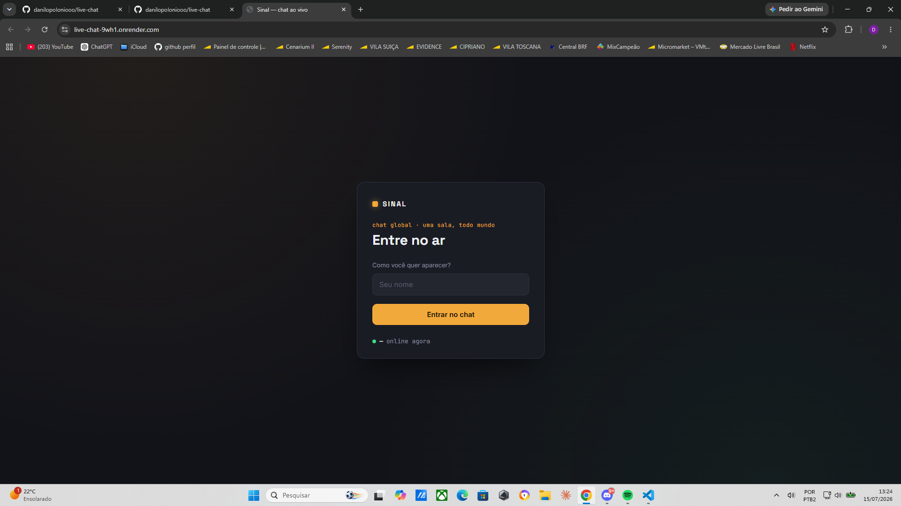

# Sinal — chat global em tempo real

Chat simples e global: você escolhe um nome, entra e já pode mandar mensagem pra todo mundo que estiver online. Sem salas, sem cadastro.



## Stack

- Node.js + Express (serve os arquivos estáticos)
- Socket.IO (comunicação em tempo real)
- HTML/CSS/JS puro no front-end (sem framework)

## Como rodar localmente

```bash
npm install
npm start
```

Depois abra `http://localhost:3000` no navegador. Abra em mais de uma aba (ou peça pra um amigo acessar seu IP na mesma rede) pra ver o chat em tempo real de verdade.

## Estrutura do projeto

```
live-chat/
├── server.js          # servidor Express + Socket.IO
├── package.json
├── public/
│   ├── index.html      # tela de entrada (nome) + tela de chat
│   ├── style.css        # interface
│   └── client.js         # lógica do front-end (socket, envio/recebimento)
└── .gitignore
```

## Sobre a pasta node_modules

Ela **não deve ir para o GitHub** — é gerada automaticamente pelo `npm install` a partir do `package.json`, e por isso está no `.gitignore`. Isso é a prática padrão em qualquer projeto Node: quem clonar o repositório roda `npm install` e a pasta é recriada localmente com as versões corretas para o sistema de cada um. Subir `node_modules` no Git infla o repositório sem necessidade e pode até quebrar em outra máquina.

## Deploy

Para colocar no ar (Render, Railway, Fly.io, etc.), basta:
1. Subir o repositório (sem `node_modules`, o serviço roda `npm install` sozinho).
2. Configurar o comando de start como `npm start`.
3. A porta é lida de `process.env.PORT`, então funciona automaticamente na maioria dos provedores.
